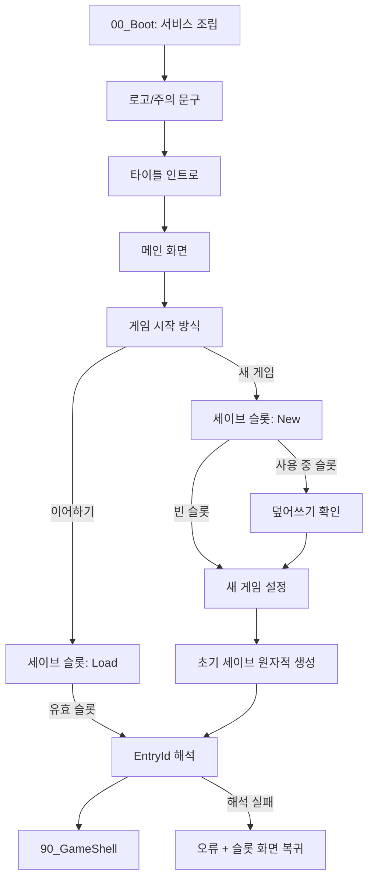

# 부팅·메뉴·세이브 진입 설계

## 목적

게임플레이가 아직 미구현이어도 실행부터 세이브 기반 진입 지점까지 검증 가능한 수직 슬라이스를 만든다.

## 씬 구성

| 씬 | 책임 |
|---|---|
| `00_Boot` | AppRoot를 만들고 앱 단위 서비스를 조립한 뒤 Frontend 로드 |
| `10_Frontend` | 로고, 타이틀, 메인, 슬롯, 새 게임 설정 화면 상태 머신 |
| `90_GameShell` | persistent shell. 세션의 EntryDestination을 받은 뒤 areaId 지역 씬을 additive 로드하는 정사영 쿼터뷰 탐색 프로토타입 |
| `91_LabInterior` | 세계조정국 연구실 내부 지역 (additive) |
| `92_BureauCourtyard` | 세계조정국 중앙 청사 앞마당 지역 (additive) |

로고·인트로·메뉴별로 씬을 나누지 않는다. 모두 `10_Frontend` 내부 상태이므로 화면 전환, Back 동작, 페이드, 입력 잠금이 한 Coordinator에 모인다.

## 앱 서비스

`AppRoot`가 다음 인터페이스 구현을 조립하고 수명주기를 소유한다.

- `IClock`
- `ISaveRepository`
- `ISaveMigrationPipeline`
- `IEntryPointResolver`
- `ISceneFlowService`
- `IPlayerSession`
- `IAppLogger`

Frontend View/Presenter는 씬 수명주기를 따르며 AppRoot가 View GameObject를 직접 참조하지 않는다.

## 사용자 플로우

### 이어하기

1. 슬롯 목록을 `Empty`, `Valid`, `Corrupt`, `Incompatible`으로 표시한다.
2. 유효 슬롯 선택 시 전체 세이브를 다시 읽고 checksum/schema/필수 필드를 검증한다.
3. 성공 시 검증된 저장 데이터를 `IPlayerSession`에 설정한다.
4. `IEntryPointResolver`가 `entryId + checkpointId`와 저장된 `areaId + spawnId`를 해석한다.
5. 성공하면 `ISceneFlowService`가 목적지 씬을 비동기 로드한다.
6. 어느 단계든 실패하면 세션을 지우고 안전한 슬롯 화면으로 돌아간다.

### 새 게임

1. New 모드에서 슬롯을 선택한다.
2. 사용 중인 슬롯은 덮어쓰기 확인을 거친다.
3. 프로필명·난이도·튜토리얼 여부를 검증한다.
4. `CreateNewGameUseCase`가 초기 데이터(`prologue_start`/`start`)를 만든다.
5. 저장 성공 후에만 세션 설정 및 씬 전환을 수행한다.
6. 저장 실패 시 설정 내용을 유지하고 재시도 또는 Back을 제공한다.

## EntryId 계약

세이브에는 Unity 씬 이름/빌드 인덱스를 직접 기록하지 않는다. 씬 개편 시 Resolver 매핑을 수정하거나 마이그레이션으로 옛 ID를 바꾼다.

| EntryId | 현재 처리 | 목적지 |
|---|---|---|
| `prologue_start` | 구현 | `90_GameShell` + `world-adjustment-lab-interior` / `reception-start` |
| `dungeon_hub` | 예약 | 명시적으로 미구현 상태 |

미지의 EntryId는 데이터 오류다. 임의의 기본 씬으로 보내지 않는다.

## GameShell 초기화 계약

`UnitySceneFlowService`는 `90_GameShell` 로드가 끝난 뒤 로드된 활성 씬의 root objects 범위에서 `GameShellRoot`가 정확히 하나인지 확인한다. 같은 `IPlayerSession`과 해석된 `EntryDestination`을 루트에 전달한다.

`GameShellRoot`는 활성 세이브, 목적지 씬, 직렬화 참조와 `AreaRegistry`를 검증한다. `90_GameShell`은 persistent shell로 남고, `AreaTransitionCoordinator`가 목적지 area scene을 additive 로드한다. 정확히 하나의 `AreaRoot`와 목적지 spawnId를 검증한 뒤 CharacterController를 배치하고 카메라를 snap한 경우에만 입력·이동·상호작용을 활성화한다. 알 수 없는 area/spawn은 원점으로 대체하지 않는다. 자세한 탐색 구조는 [`EXPLORATION_PROTOTYPE.md`](EXPLORATION_PROTOTYPE.md)를 따른다.

## 범위 밖

- 실제 전투/던전 게임플레이
- 클라우드 세이브·계정 동기화
- 세이브 암호화·치트 방지
- Addressables, 외부 UI 프레임워크
- 현지화 시스템 완성 및 아트 제작
